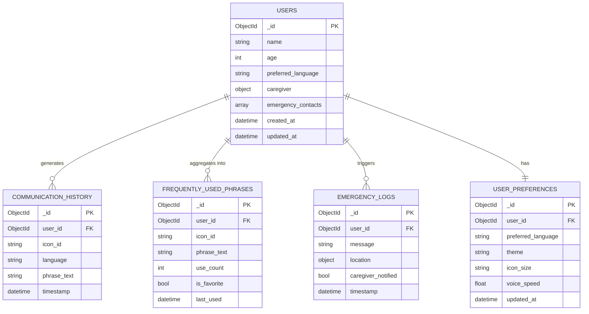

# TouchSpeak AI — ER Diagram

MongoDB is document-oriented (no foreign keys), but the collections have a
clear relational shape via `user_id` references — shown below in
entity-relationship form.

```mermaid
erDiagram
    USERS ||--o{ COMMUNICATION_HISTORY : "generates"
    USERS ||--o{ FREQUENTLY_USED_PHRASES : "aggregates into"
    USERS ||--o{ EMERGENCY_LOGS : "triggers"
    USERS ||--|| USER_PREFERENCES : "has"

    USERS {
        ObjectId _id PK
        string name
        int age
        string preferred_language
        object caregiver
        array emergency_contacts
        datetime created_at
        datetime updated_at
    }

    COMMUNICATION_HISTORY {
        ObjectId _id PK
        ObjectId user_id FK
        string icon_id
        string language
        string phrase_text
        datetime timestamp
    }

    FREQUENTLY_USED_PHRASES {
        ObjectId _id PK
        ObjectId user_id FK
        string icon_id
        string phrase_text
        int use_count
        bool is_favorite
        datetime last_used
    }

    EMERGENCY_LOGS {
        ObjectId _id PK
        ObjectId user_id FK
        string message
        object location
        bool caregiver_notified
        datetime timestamp
    }

    USER_PREFERENCES {
        ObjectId _id PK
        ObjectId user_id FK
        string preferred_language
        string theme
        string icon_size
        float voice_speed
        datetime updated_at
    }
```
