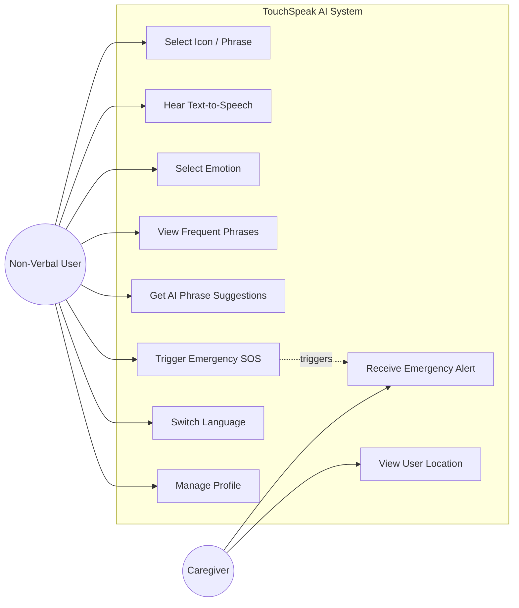
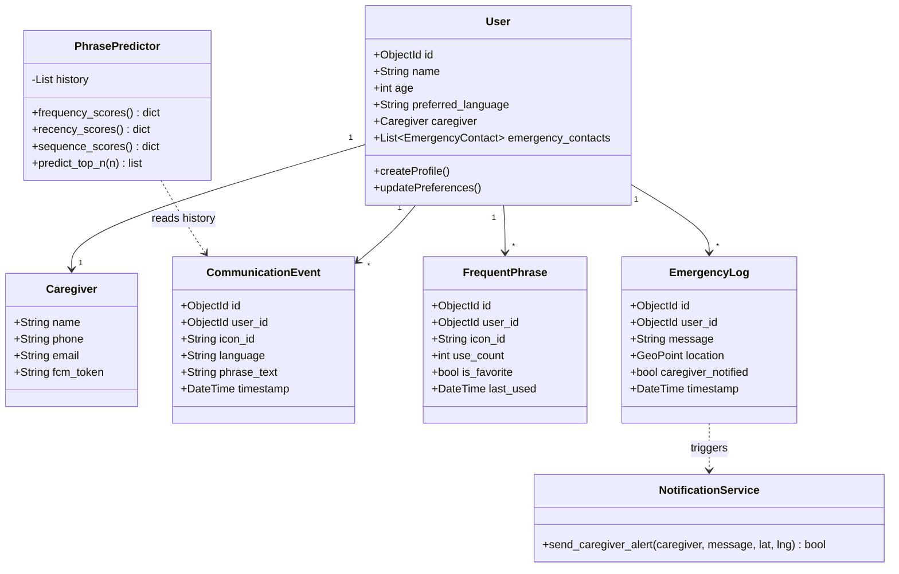
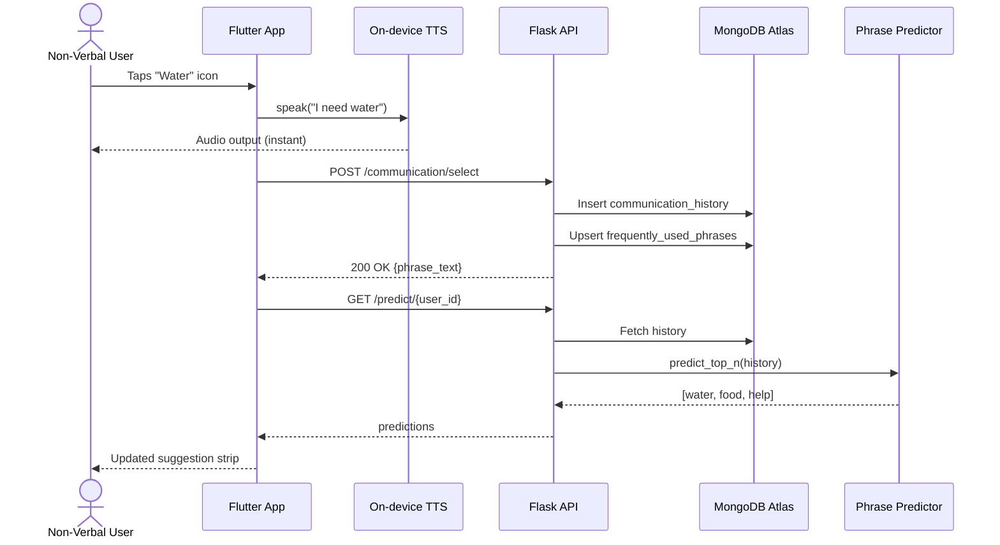
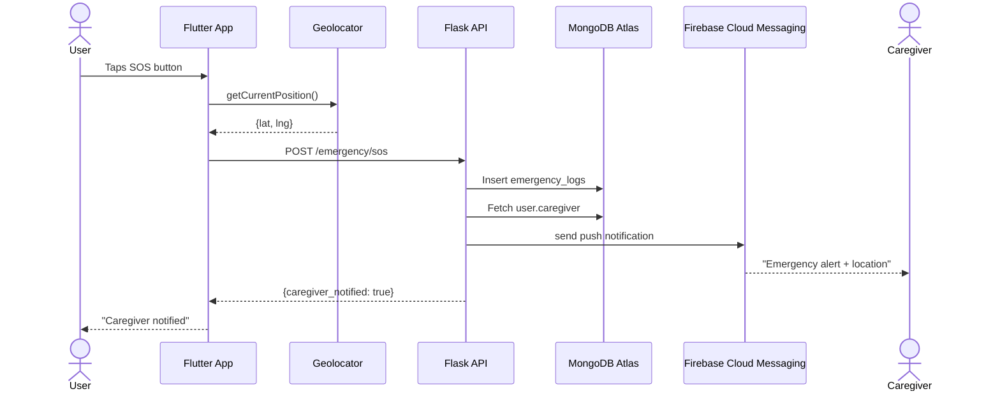
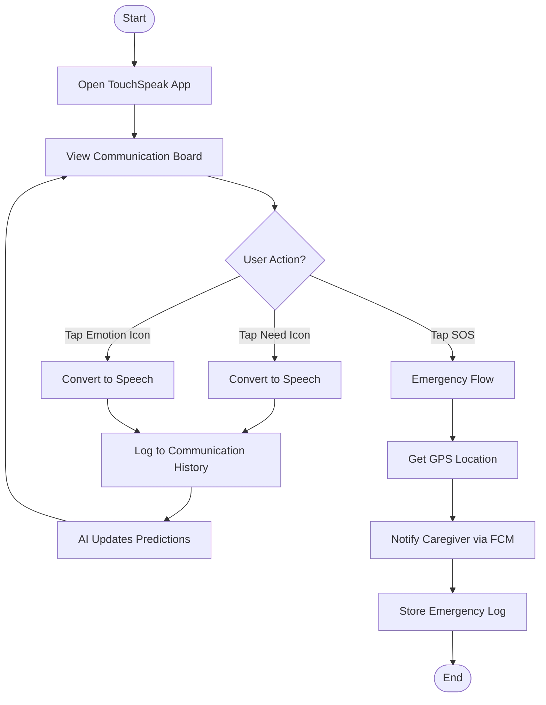

# TouchSpeak AI — UML Diagrams

All diagrams are in Mermaid syntax — render them on GitHub, in VS Code (Mermaid
preview extension), or at https://mermaid.live

## 1. Use Case Diagram

## 2. Class Diagram

## 3. Sequence Diagram — Icon Tap to Speech Output

## 4. Sequence Diagram — Emergency SOS

## 5. Activity Diagram — Communication Flow

